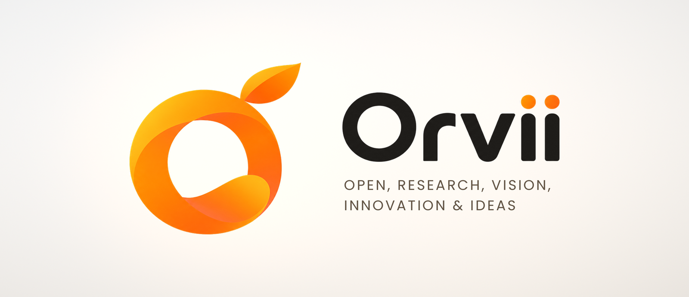

<picture>
  <source media="(prefers-color-scheme: dark)" srcset="../assets/banner-dark.png">
  
</picture>

<picture>
  <source media="(prefers-color-scheme: dark)" srcset="hero.svg">
  
</picture>

# Orvii

**Open, Research, Vision, Innovation & Ideas.**

Orvii is a two-person collective. Building useful, experimental and open-source software together. We publish what we learn while building it: the measurements, the dead ends, and the numbers that surprised us. Not a company, not a content channel. A lab notebook with a compiler.

The name is the method. Five letters, one feedback loop:

<picture>
  <source media="(prefers-color-scheme: dark)" srcset="pillars.svg">
  
</picture>

- **Open** — source, data and failure modes in public. A result nobody can rerun is an anecdote.
- **Research** — start from a question that has no obvious answer, not from a product backlog.
- **Vision** — pick directions the tooling hasn't caught up to yet, and build toward them anyway.
- **Innovation** — the boring kind: fewer moving parts, faster paths, crash-safe state.
- **Ideas** — written down, argued about, tested. Unwritten ideas are just weather.

`est. 2026 · Türkiye · two developers · open source by default`

## What we are building

### ts-lto — a link-time optimizer for TypeScript

The flagship, currently in private development. TypeScript tooling optimizes files; almost nothing optimizes *programs*. ts-lto runs whole-program, type-aware semantic optimization on the real TypeScript Compiler API:

| Pass | What it does |
|---|---|
| reachability DCE | deletes code no entry point can ever execute — proven unreachable by the type graph, not by string matching |
| cross-module constant propagation | folds values across module boundaries that single-file bundlers must keep live |
| semantic inlining | inlines calls where the type system guarantees the callee cannot observe its caller |

The gate is the interesting part: a **behavioral-equivalence test suite**. Every optimization must prove the optimized program behaves identically to the original on the full scenario inventory — same outputs, same throw paths, same observable order. An optimization that cannot prove equivalence does not ship, no matter how many milliseconds it saves.

Status: private. It opens to the public the day the equivalence gate is green end-to-end. This page will say so here, with a date, when it happens.

### Research infrastructure

Everything we measure with is itself a deliverable. Harnesses, log schemas and analysis notebooks graduate into their own repos as soon as they are stable enough for a stranger to run.

### Published

| Repo | What it is |
|---|---|
| [harness-atlas](https://github.com/Orvii/harness-atlas) | What AI coding harnesses promise and support — capability matrix with pinned versions and a fetched-doc citation on every cell |
| [svg-instruments](https://github.com/Orvii/svg-instruments) | Animated SVG patterns that survive the GitHub sanitizer, with copy-paste kits and degradation notes |
| [bench-notes](https://github.com/Orvii/bench-notes) | Benchmark methodology notes: one failure mode per note, each with a failure example and the case where the advice inverts |

## The research agenda

Questions we are actively chasing, in rough priority order. Each one becomes a repo, a note, or a retraction — all three count as publishing.

**1. How reliable are LLM inference providers, really?**
Public status pages say "operational"; the wire says otherwise. We are building a reproducible reliability harness for LLM inference providers: per-provider error spectra (429 / 502 / 504 / silent truncation), latency distributions under real agent workloads, retry storms, and how aliasing the same model under different names changes behavior. The deliverable is the harness plus an open dataset — aggregated and sanitized, never raw traffic.

**2. What does prompt caching actually cost — and when does it silently stop working?**
Cache-hit economics vary wildly across providers, and small request-shape changes (a stray `cache_control` block, a reordered tool definition) can collapse a 99% hit rate to single digits without any error being raised. We are mapping which request mutations kill the cache on which provider, and what that costs in tokens and money.

**3. Can a compiler pass prove it changed nothing?**
The thesis behind ts-lto, generalized: behavioral equivalence as a first-class, machine-checked artifact for program transformations. Where does equivalence testing scale, where does it explode combinatorially, and what is the cheapest sound approximation?

**4. Small-lab methodology.**
What can a two-person team with no GPU cluster legitimately contribute to a field dominated by compute? Our working answer: *observation and verification* — telemetry, harnesses, equivalence gates — the parts of science that need rigor, not flops. We write this down as we learn whether it's true.

## The loop

<picture>
  <source media="(prefers-color-scheme: dark)" srcset="terminal.svg">
  
</picture>

## How we work

- **Measure before claiming.** No benchmark in prose. If a number appears in a README, the harness that produced it is in the repo.
- **Open by default.** Public repos, permissive licenses, data published alongside conclusions. Private is a temporary state with an exit condition, never a business model.
- **Small ships.** A finding published today beats a magnum opus published never. Repos start small and grow in public.
- **Root cause over symptom.** A fixed bug ships together with the test that would have caught it. Patches that don't outlive their author aren't fixes.
- **Honest labels.** Alpha means alpha. Small numbers get published as-is; the trend line is the point, not the vanity metric.
- **Two reviewers minimum.** Every human in the collective reviews the other's work. No self-merges on anything that ships.

## Field notes

Findings land in [Orvii Discussions](https://github.com/orgs/Orvii/discussions) first — raw, dated, occasionally wrong and later corrected in place. Notes that survive scrutiny and replication graduate into repos on this page. Retractions stay up; a corrected mistake is more useful than a hidden one.

## Collaborate

Orvii is two people, but the notebook is public. If you want in:

- **Reproduce something.** Pick any published measurement, rerun it, and tell us where it breaks. Falsification is collaboration.
- **Argue in Discussions.** Open a thread on any agenda item. We answer with data or with "we don't know yet" — both are useful.
- **Send problems.** Interesting failures from your own systems make excellent research questions. Anonymized telemetry welcome; secrets never.

## Contact

- Organization — [github.com/Orvii](https://github.com/Orvii)
- Discussions — [github.com/orgs/Orvii/discussions](https://github.com/orgs/Orvii/discussions)

Orvii — Open, Research, Vision, Innovation &amp; Ideas. This page is generated from the org profile repo; the SVG instruments animate in-browser and degrade to finished stills when motion is reduced.
